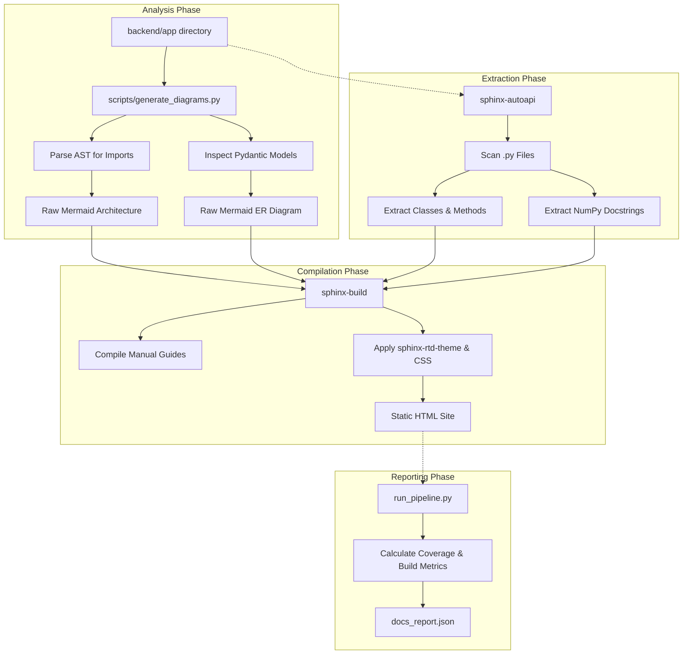

# AutoCodeDoc Platform

**Project: [Live Documentation Site](https://koffandaff.github.io/AutoCodeDoc/sphinx/)**

A production-grade, fully automated documentation engine that turns your Python codebase into a beautiful, live-updating documentation site. Powered entirely by NumPy-style docstrings and AST parsing.

---

## Table of Contents

1. [Features](#features)
2. [Screenshots](#screenshots)
   - [Home](#home)
   - [API Reference](#api-reference)
   - [System Architecture](#system-architecture)
   - [ER Diagram](#er-diagram)
   - [Cross-Repo Flow](#cross-repo-flow)
   - [ML Documentation](#ml-documentation)
   - [Contributing Guide](#contributing-guide)
3. [CI/CD Pipeline Output](#cicd-pipeline-output)
   - [Case 1: Successful Build](#case-1-successful-build)
   - [Case 2: Failed Build (Syntax/Import Error)](#case-2-failed-build-syntaximport-error)
4. [Tools Used](#tools-used)
5. [How It Works (Architecture)](#how-it-works-architecture)
6. [Project Structure](#project-structure)
7. [Installation](#installation)
8. [Usage](#usage)

---

## Features

- **Automated API Reference**: Every FastAPI route, Pydantic model, and Machine Learning class is documented instantly using `sphinx-autoapi`. No manual Markdown files required.
- **AST-Based System Architecture**: A custom abstract syntax tree (AST) parser reads Python `import` statements to dynamically map how APIs, Services, and Models connect.
- **Self-Pruning ER Diagrams**: True Entity-Relationship diagrams generated directly from Pydantic model fields and relationships. If you delete a model, it disappears from the diagram automatically.
- **Live-Reloading Server**: Includes a custom `watch_docs.py` watcher that instantly rebuilds docs and refreshes your browser the moment you save a file.
- **Docstring Coverage Check**: Integrates `interrogate` to ensure NumPy-style docstrings are present, providing coverage reports during the CI/CD pipeline.
- **Cross-Repo Data Flow**: Automatically generates Mermaid.js flowcharts to map out multi-repository data pipelines.
- **Non-Blocking Output**: Generates a standardized `docs_report.json` and `diagrams_report.json` after every build for deep integration with GitHub Actions.

---

## Screenshots

Below is a visual tour of the generated documentation.

### Home


*Placeholder: Screenshot of the Sphinx Homepage*

### API Reference


*Placeholder: Screenshot of the Auto-Generated API Reference showing classes and methods*

### System Architecture


*Placeholder: Screenshot of the AST-generated system architecture diagram*

### ER Diagram


*Placeholder: Screenshot of the Pydantic-generated Entity-Relationship diagram*

### Cross-Repo Flow


*Placeholder: Screenshot of the mllam-data-prep to neural-lam data pipeline*

### ML Documentation


*Placeholder: Screenshot of the ML hyperparameter and model documentation*

### Contributing Guide


*Placeholder: Screenshot of the NumPy docstring standards guide*

---

## CI/CD Pipeline Output

The project utilizes GitHub Actions to execute the documentation pipeline. The pipeline performs linting, coverage analysis, diagram generation, and HTML building.

### Case 1: Successful Build
When code is pushed with valid syntax and no critical Sphinx errors, the pipeline succeeds.

1. **Lint**: `flake8` passes.
2. **Tests**: `pytest` passes all internal checks (`test_autoapi.py`, `test_diagrams.py`).
3. **Coverage**: `interrogate` outputs the coverage percentage (this is non-blocking, so a low score still passes the build).
4. **Deploy**: The `site/sphinx` directory is pushed to the `gh-pages` branch, making the site live instantly.


#### Doc added


*Placeholder: Screenshot of a passing GitHub Actions run*

### Case 2: Failed Build (Syntax/Import Error)
The pipeline acts as a strict guardrail against broken documentation.

1. **Failure Trigger**: If a developer pushes Python code with a fundamental syntax error, or if they forget to import a required module.
2. **Detection**: The `pytest` suite running `test_docs_build.py` runs `sphinx-build -W` (treat warnings as errors).
3. **Result**: The build halts. The broken documentation is **not** deployed to `gh-pages`, protecting the live site from showing 404s or broken imports.


*Placeholder: Screenshot of a failing GitHub Actions run catching a documentation error*

---

## Tools Used

| Tool | Purpose |
|------|---------|
| **Sphinx** | The primary documentation compilation engine. |
| **sphinx-autoapi** | Parses Python source recursively to generate API pages without importing code. |
| **napoleon** | Sphinx extension that allows parsing of NumPy-style docstrings. |
| **sphinxcontrib-mermaid** | Embeds Mermaid.js diagrams directly into the built HTML. |
| **interrogate** | Analyzes docstring coverage across the backend. |
| **pytest** | Used as the test runner in the CI/CD pipeline to validate the build process. |
| **MkDocs** (Legacy) | Maintained simultaneously for backward compatibility. |
| **GitHub Actions & Pages** | CI/CD execution and static site hosting. |

---

## How It Works (Architecture)

The documentation engine is entirely decoupled from the business logic, operating sequentially on the source code:



---

## Project Structure

```text
├── .github/workflows/      # Automated CI/CD pipeline configurations
├── backend/
│   ├── app/                # Main Application Logic (APIs, Services, Models, ML)
│   └── tests/              # Test suite to verify Sphinx build and diagrams
├── docs/                   
│   ├── assets/             # Screenshots and images
│   ├── architecture/       # Auto-generated Mermaid diagram files
│   ├── guides/             # Manually written markdown guides
│   ├── api/                # Auto-generated by AutoAPI (ignored in git)
│   ├── conf.py             # Sphinx configuration
│   └── index.rst           # Documentation Homepage
├── scripts/                # The Automation Engine
│   ├── generate_diagrams.py# AST-based architecture and ER generator
│   ├── generate_report.py  # JSON report compiler
│   └── watch_docs.py       # Live-reloading Sphinx server
├── run_pipeline.py         # Full pipeline orchestrator
├── auto_docs.bat           # Windows script: Live-reload server
└── build_docs.bat          # Windows script: Full production build
```

---

## Installation

### Prerequisites
- Python 3.10+
- Git

### Setup Steps
1. Clone the repository:
```bash
git clone https://github.com/koffandaff/AutoCodeDoc.git
cd AutoCodeDoc/doc_automation_platform
```

2. Set up the virtual environment:
```bash
# Windows
python -m venv venv
venv\Scripts\activate

# Mac/Linux
python3 -m venv venv
source venv/bin/activate
```

3. Install dependencies:
```bash
pip install -r requirements.txt
```

---

## Usage

### Local Development (Windows)
For the easiest experience, use the provided batch scripts:

- **Live Coding Mode**:
  Run `auto_docs.bat`. This starts a watcher server. Whenever you save a `.py` file, it instantly rebuilds the documentation and refreshes your browser at `http://127.0.0.1:8000`.

- **Production Audit Mode**:
  Run `build_docs.bat`. This runs the full pipeline (coverage checks, newly generated diagrams) and produces the final HTML in `site/sphinx`.

### Manual CLI Execution
If you prefer running commands manually or are on Mac/Linux:

```bash
# Full pipeline (Coverage, Diagrams, HTML Build)
python run_pipeline.py --build-only

# Live watcher server
python scripts/watch_docs.py
```
