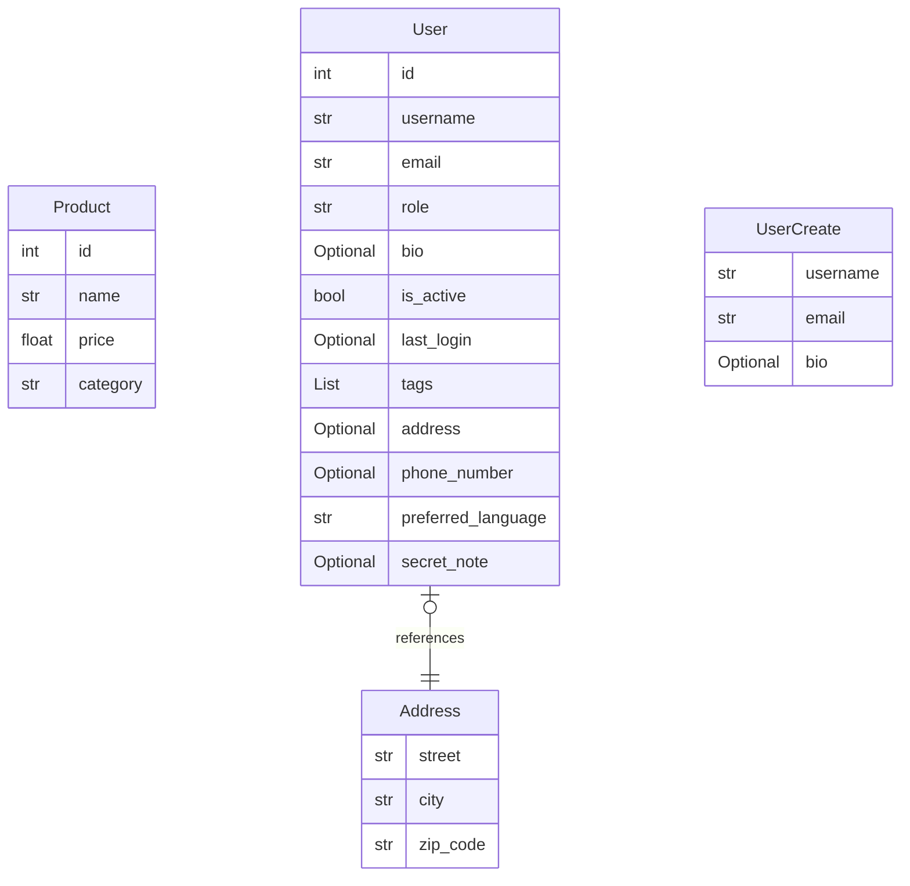

# Database Schema

Detailed breakdown of the platform's data models.

## Entity: Address

Physical address of a user.

| Field | Type | Description | Default |
|-------|------|-------------|---------|
| `street` | `str` | Street name and number. | *Required* |
| `city` | `str` | City name. | *Required* |
| `zip_code` | `str` | Postal zip code. | *Required* |

## Entity: Product

Model representing a store product.

| Field | Type | Description | Default |
|-------|------|-------------|---------|
| `id` | `int` | Unique product ID. | *Required* |
| `name` | `str` | Name of the product. | *Required* |
| `price` | `float` | Price in USD. | *Required* |
| `category` | `str` | Product category (e.g., 'Electronics'). | *Required* |

## Entity: User

User model representing an account in the system.

| Field | Type | Description | Default |
|-------|------|-------------|---------|
| `id` | `int` | The unique identifier for the user. | *Required* |
| `username` | `str` | The login username. | *Required* |
| `email` | `str` | The email address of the user. | *Required* |
| `role` | `str` | The user's role (e.g., 'admin', 'user'). | `user` |
| `bio` | `Optional` | A short biography of the user. | `None` |
| `is_active` | `bool` | Whether the user account is currently active. | `True` |
| `last_login` | `Optional` | Timestamp of the last successful login. | `None` |
| `tags` | `List` | Categorization tags for the user. | `list()` |
| `address` | `Optional` | User's primary mailing address. | `None` |
| `phone_number` | `Optional` | The user's contact phone number. | `None` |
| `preferred_language` | `str` | The user's preferred language code. | `en` |
| `secret_note` | `Optional` | A private note for administrative use only. | `None` |

## Entity: UserCreate

Model used to create a new User entry.

| Field | Type | Description | Default |
|-------|------|-------------|---------|
| `username` | `str` | The chosen username. | *Required* |
| `email` | `str` | The associated email address. | *Required* |
| `bio` | `Optional` | A short biography for the profile. | `None` |

## Entity: PaymentRequest

Model used to initiate a payment transaction.

| Field | Type | Description | Default |
|-------|------|-------------|---------|
| `amount` | `float` | The transaction amount. | *Required* |
| `currency` | `str` | The currency code (e.g., 'USD'). | `USD` |
| `payment_method` | `str` | The chosen payment method (e.g., 'credit_card', 'paypal'). | `credit_card` |

## Entity: PaymentResponse

Response returned after a payment attempt.

| Field | Type | Description | Default |
|-------|------|-------------|---------|
| `transaction_id` | `str` | Unique gateway transaction ID. | *Required* |
| `status` | `str` | Payment status (e.g., 'success', 'failed'). | *Required* |

## Entity: Token

Authentication token details.

| Field | Type | Description | Default |
|-------|------|-------------|---------|
| `access_token` | `str` | The JWT access token. | *Required* |
| `token_type` | `str` | The type of token (e.g., 'Bearer'). | *Required* |
| `expires_in` | `int` | The duration in seconds until the token expires. | `3600` |

## Data Relationships

