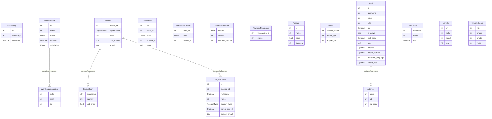

# Database Schema

Comprehensive breakdown of all platform data models, auto-generated from Pydantic source code.

## Entity-Relationship Diagram

This true ER diagram is built dynamically by scanning all database models and their fields.

---

## Data Dictionary

### Entity: Token

Authentication token details.

| Field | Type | Description | Default |
|-------|------|-------------|---------|
| `access_token` | `str` | The JWT access token. | *Required* |
| `token_type` | `str` | The type of token (e.g., 'Bearer'). | *Required* |
| `expires_in` | `int` | The duration in seconds until the token expires. | `3600` |

### Entity: Notification

Notification model for system alerts and user messages.

| Field | Type | Description | Default |
|-------|------|-------------|---------|
| `id` | `str` | Unique identifier for the notification. | *Required* |
| `user_id` | `int` | The ID of the user receiving the notification. | *Required* |
| `type` | `Literal` | The delivery channel. | *Required* |
| `message` | `str` | The actual notification content. | *Required* |
| `read` | `bool` | Whether the notification has been read. | `False` |

### Entity: NotificationCreate

Payload to trigger a new notification.

| Field | Type | Description | Default |
|-------|------|-------------|---------|
| `user_id` | `int` | The ID of the target user. | *Required* |
| `type` | `Literal` | The desired delivery channel. | *Required* |
| `message` | `str` | The message payload. | *Required* |

### Entity: BaseEntity

Base class for all enterprise entities.

| Field | Type | Description | Default |
|-------|------|-------------|---------|
| `id` | `str` | Unique identifier. | *Required* |
| `created_at` | `str` | Creation ISO timestamp. | *Required* |
| `metadata` | `Optional` | Extensible metadata dictionary. | `None` |

### Entity: Organization

An enterprise organization.

| Field | Type | Description | Default |
|-------|------|-------------|---------|
| `id` | `str` | Unique identifier. | *Required* |
| `created_at` | `str` | Creation ISO timestamp. | *Required* |
| `metadata` | `Optional` | Extensible metadata dictionary. | `None` |
| `name` | `str` | Name of the organization. | *Required* |
| `account_type` | `AccountType` | The subscription tier. | `AccountType.BASIC` |
| `parent_org_id` | `Optional` | Parent organization ID if applicable (forward reference test). | `None` |
| `contact_emails` | `List` | List of administrative contact emails. | *Required* |

### Entity: Invoice

A billing invoice for an organization.

| Field | Type | Description | Default |
|-------|------|-------------|---------|
| `invoice_id` | `str` | Unique invoice number. | *Required* |
| `organization` | `Organization` | The organization being billed. | *Required* |
| `items` | `List` | List of line items on the invoice. | *Required* |
| `total_amount` | `float` | Total amount due. | *Required* |
| `is_paid` | `bool` | Whether the invoice has been settled. | `False` |

### Entity: InvoiceItem

Line item on an enterprise invoice.

| Field | Type | Description | Default |
|-------|------|-------------|---------|
| `description` | `str` | Line item description. | *Required* |
| `quantity` | `int` | Quantity of items. | `1` |
| `unit_price` | `float` | Price per unit. | *Required* |

### Entity: InventoryItem

An item stored in the warehouse.

| Field | Type | Description | Default |
|-------|------|-------------|---------|
| `sku` | `str` | Stock Keeping Unit. | `<lambda>()` |
| `name` | `str` | Product name. | *Required* |
| `status` | `Literal` | Current stock status. | `available` |
| `location` | `Optional` | Where the item is physically located. | `None` |
| `weight_kg` | `Union` | Weight of the item in kilograms (testing Union). | *Required* |

### Entity: WarehouseLocation

A physical storage location.

| Field | Type | Description | Default |
|-------|------|-------------|---------|
| `aisle` | `str` | Aisle identifier. | *Required* |
| `shelf` | `str` | Shelf level. | *Required* |
| `bin` | `str` | Specific bin number. | *Required* |

### Entity: PaymentRequest

Model used to initiate a payment transaction.

| Field | Type | Description | Default |
|-------|------|-------------|---------|
| `amount` | `float` | The transaction amount. | *Required* |
| `currency` | `str` | The currency code (e.g., 'USD'). | `USD` |
| `payment_method` | `str` | The chosen payment method (e.g., 'credit_card', 'paypal'). | `credit_card` |

### Entity: PaymentResponse

Response returned after a payment attempt.

| Field | Type | Description | Default |
|-------|------|-------------|---------|
| `transaction_id` | `str` | Unique gateway transaction ID. | *Required* |
| `status` | `str` | Payment status (e.g., 'success', 'failed'). | *Required* |

### Entity: Address

Physical address of a user.

| Field | Type | Description | Default |
|-------|------|-------------|---------|
| `street` | `str` | Street name and number. | *Required* |
| `city` | `str` | City name. | *Required* |
| `zip_code` | `str` | Postal zip code. | *Required* |

### Entity: Product

Model representing a store product.

| Field | Type | Description | Default |
|-------|------|-------------|---------|
| `id` | `int` | Unique product ID. | *Required* |
| `name` | `str` | Name of the product. | *Required* |
| `price` | `float` | Price in USD. | *Required* |
| `category` | `str` | Product category (e.g., 'Electronics'). | *Required* |

### Entity: User

User model representing an account in the system.

| Field | Type | Description | Default |
|-------|------|-------------|---------|
| `id` | `int` | The unique identifier for the user. | *Required* |
| `username` | `str` | The login username. | *Required* |
| `email` | `str` | The email address of the user. | *Required* |
| `role` | `str` | The user's role (e.g., 'admin', 'user'). | `user` |
| `bio` | `Optional` | A short biography of the user. | `None` |
| `is_active` | `bool` | Whether the user account is currently active. | `True` |
| `last_login` | `Optional` | Timestamp of the last successful login. | `None` |
| `tags` | `List` | Categorization tags for the user. | `list()` |
| `address` | `Optional` | User's primary mailing address. | `None` |
| `phone_number` | `Optional` | The user's contact phone number. | `None` |
| `preferred_language` | `str` | The user's preferred language code. | `en` |
| `secret_note` | `Optional` | A private note for administrative use only. | `None` |

### Entity: UserCreate

Model used to create a new User entry.

| Field | Type | Description | Default |
|-------|------|-------------|---------|
| `username` | `str` | The chosen username. | *Required* |
| `email` | `str` | The associated email address. | *Required* |
| `bio` | `Optional` | A short biography for the profile. | `None` |

### Entity: Vehicle

A motorized vehicle registered in the system.

| Field | Type | Description | Default |
|-------|------|-------------|---------|
| `vin` | `str` | The unique Vehicle Identification Number. | *Required* |
| `make` | `str` | The manufacturer (e.g., Toyota, Ford). | *Required* |
| `model` | `str` | The specific car model. | *Required* |
| `year` | `int` | The manufacturing year. | *Required* |

### Entity: VehicleCreate

Payload to register a new vehicle.

| Field | Type | Description | Default |
|-------|------|-------------|---------|
| `vin` | `str` | The unique Vehicle Identification Number. | *Required* |
| `make` | `str` | The manufacturer (e.g., Toyota, Ford). | *Required* |
| `model` | `str` | The specific car model. | *Required* |
| `year` | `int` | The manufacturing year. | *Required* |

